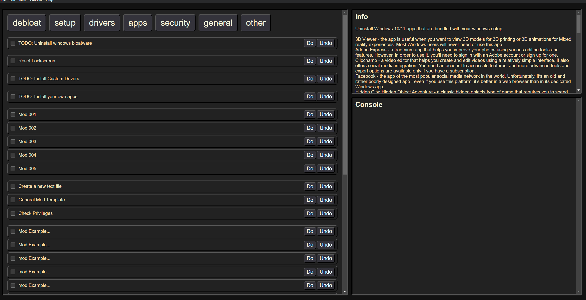

# Development paused temporarily

# Automate Windows Deployment
This app helps you customise and automate the whole Windows setup plus the software ecosystem with your own personal settings, drivers, apps and work environments. It also helps you debloat Windows, optimize, improve privacy and security.
Typicat use case scenarios:
- you are reinstalling a system on the same or different machine for any number of reasons (crash, upgrade, machine replacement etc)
- you are installing a specific system/configuration on a number of different machines
This is geared towards developers who typically need to install a lot of tools/apps, each with their own configurations, security settings, logins on top of the typical Windows apps, but it will work just as well for any type of professional who needs to install any number of apps/systems/settings.

This app is in active development. It is a refactoring of an older massive app that's fully cmd/powershell based, with no UI. It uses Electron to add a friendly user interface to that massive powershell library

# UI Demo

# DONE:
- electron app setup
- UX architecture
- Automatically generated interface (HTML/css dynamically generated via with JS from json config files)
- Hijacked the powershell environment console and the node console to a user friendly console.
- Mechanism to add Mods automatically to the UI from ps1/psm1/cmd/bat/json files
- UX prettyfication: CSS, hover effects, sound, info panel etc
- CSS optimisation
- Created Mod template
- Connected Windows APIs to Node/Electron API
- setup electron-builder, created test build
- Done stable .exe distributable file
- Added and tested a few generic Mods
- Added batch execution of .cab/.msi/.exe files
- Privilege elevation of node clild_process.spawn (equivalent to "Run as Admin")

# TODO
- End-User Access to batch folders (drivers, apps, scripts)
- Digital signature
- Antivirus permissions (batch execution is a virus-like behavior)
- Ability for the End-user to create/download/backup current system settings/config files
- Ability for the End-user to import/apply system settings/config files
- Encryption and secure storage of user creentials
- system permissions?
- app security?
- logging
- error handling
- custom script execution (?)
- app update channel
